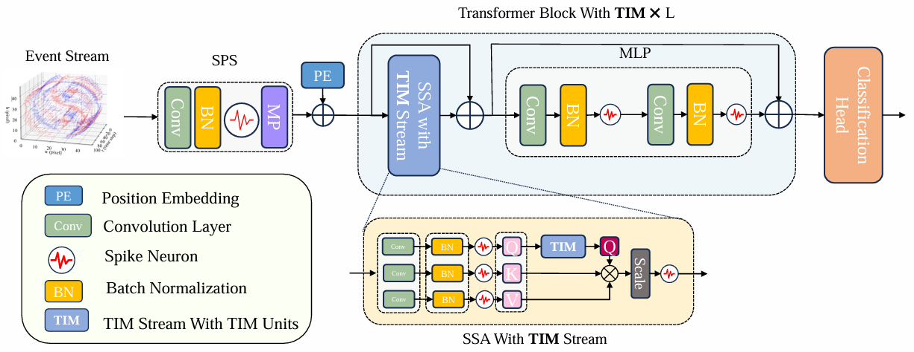

# TIM: An Efficient Temporal Interaction Module for Spiking Transformer, [IJCAI2024](https://arxiv.org/abs/2401.11687)



## Reference
```
@misc{shen2024tim,
      title={TIM: An Efficient Temporal Interaction Module for Spiking Transformer}, 
      author={Sicheng Shen and Dongcheng Zhao and Guobin Shen and Yi Zeng},
      year={2024},
      eprint={2401.11687},
      archivePrefix={arXiv},
      primaryClass={cs.NE}
}
```

Here is the official implemented code of TIM. The code is based on Pytorch and [Braincog](https://github.com/BrainCog-X/Brain-Cog)

## Requirements
### Create Braincog Virtual Environment
```
conda create -n braincog python=3.8
conda activate braincog
pip install braincog
```
### Dataset Preparation
**Datasets Needed**: CIFAR10-DVS, N-CALTECH101, UCF101DVS, NCARS, HMDB51DVS, SHD
Please unzip data to ```/data/datasets``` so that dataset.py may directly load corresponding dataset for training

#### HMDB51DVS
We have received some feedback indicating that generating the .mat files for HMDB51DVS using certain methods may cause the process to hang, making it impossible to load the data using BrainCog’s scripts. Therefore, we have provided the preprocessed data on a cloud drive. (Please note that first-time users may need to register to access the drive.)

Download link：[here](https://www.123912.com/s/Q2govd-hsn5H)

## Model Training
For most DVS data, we prefer using the event-frame size of 64 but not 128 here.
Please adjust your hyper parameters here. 10 is set as the default value of time step numbers.
```
@register_model
def spikformer_dvs(pretrained=False, **kwargs):
    model = Spikformer(TIM_alpha=0.5,step=10,if_UCF=False,num_classes=10,
        # img_size_h=64, img_size_w=64,
        # patch_size=16, embed_dims=256, num_heads=16, mlp_ratios=4,
        # in_channels=2, qkv_bias=False,
        # depths=2, sr_ratios=1,
        **kwargs
    )
    model.default_cfg = _cfg()
    return model
```
### Training on CIFAR10-DVS
```
python main.py --model spikformer_dvs --dataset dvsc10 --epoch 500 --batch-size 16 --event-size 64 
```
### Training on N-CALTECH101
```num_classes``` should be set to 101
```
python main.py --model spikformer_dvs --dataset NCALTECH101 --epoch 500 --batch-size 16 --event-size 64  --num_classes 101
```

### Training on NCARS
```num_classes``` should be set to 2
```
python main.py --model spikformer_dvs --dataset NCARS --epoch 500 --batch-size 16 --event-size 64  --num_classes 2
```
### Training on UCF101DVS
```num_classes``` should be set to 101,```if_UCF``` should be set to ```True``` 
```
python main.py --model spikformer_dvs --dataset UCF101DVS --epoch 500 --batch-size 16 --event-size 64  --num_classes 101
```

### Training on SHD
```num_classes``` should be set to 20
```
python main.py --model spikformer_shd --dataset SHD --epoch 500 --batch-size 16 --num_classes 20
```
